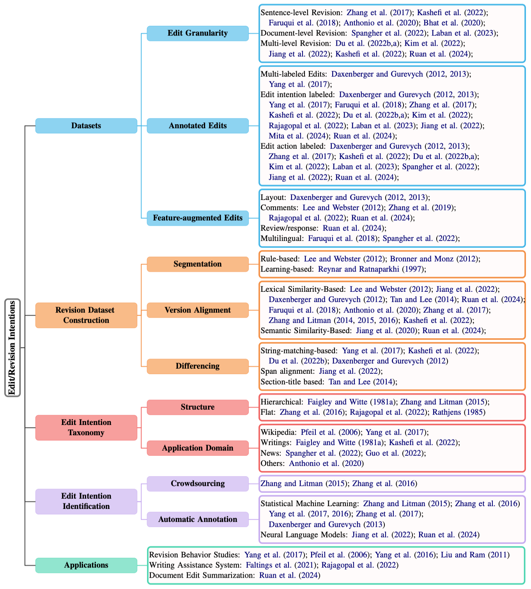

<div align="center">
  <h1>Make Revisions Understandable - A Survey of Edit Intentions, Methods, and Applications</h1>
  <a href="https://awesome.re">
    
  </a>
  <a href="https://img.shields.io/badge/PRs-Welcome-red">
    
  </a>
  <!-- <a href="https://img.shields.io/github/last-commit/withinmiaov/A-Survey-on-Mixture-of-Experts?color=green">
    
  </a> -->
</div>

Text revision is a core process in document creation, capturing how authors iteratively refine, reorganize, and improve written content. With the increasing availability of large-scale revision histories from platforms such as Wikipedia and arXiv, NLP research has begun to move beyond modeling what changes are made to understanding why they are made, i.e., the underlying edit intentions. To our knowledge, this is the first survey that synthesizes text revision research through the lens of edit intentions, providing a unified view of datasets, taxonomies, identification methods, and applications. We review prior work across the full revision workflow, including revision corpus construction, edit intention taxonomy design, and edit intention identification. We further categorize representative datasets and methods, summarize downstream applications such as writing assistance and document edit summarization, and highlight key open research directions.

> [!IMPORTANT]
> **Good news! :tada: Our survey paper has been successfully accepted by Findings of ACL 2026. :fire::fire::fire:**
> 
> A curated collection of papers and resources on edit intentions behind text revisions.
> 
> Please refer to our survey [**"Make Revisions Understandable - A Survey of Edit Intentions, Methods, and Applications"**]() for the detailed contents. 
> 
> Please let us know if you discover any mistakes or have suggestions by emailing us: fangping.lan@temple.edu

## Table of Contents
- [Taxonomy](#taxonomy)
- [Paper List](#paper-list-organized-chronologically-and-categorically)
- [Citation](#citation)
- [Star History](#star-history)

## Taxonomy

<p align="center" width="100%">
  
</p>

<div align="right">
    <b><a href="#table-of-contents">↥ back to top</a></b>
</div>


## Paper List
### Languages
**Multilingual**
- (2006)[Cultural Differences in Collaborative Authoring of Wikipedia](https://academic.oup.com/jcmc/article/12/1/88/4582988)
- (2018)[WikiAtomicEdits: A Multilingual Corpus of Wikipedia Edits for Modeling Language and Discourse](https://aclanthology.org/D18-1028/)
- (2022)[NewsEdits: A News Article Revision Dataset and a Document-Level Reasoning Challenge](https://aclanthology.org/2022.naacl-main.10/)

### Granularities

**Words/phrases-level**
- (2010)[Annotating esl errors: Challenges and rewards](https://aclanthology.org/W10-1004/)
- (2012)[Correction Detection and Error Type Selection as an ESL Educational Aid](https://aclanthology.org/N12-1037/)
- (2014)[Improved Correction Detection in Revised ESL Sentences](https://aclanthology.org/P14-2098/)
- (2018)[WikiAtomicEdits: A Multilingual Corpus of Wikipedia Edits for Modeling Language and Discourse](https://aclanthology.org/D18-1028/)

**Sentence-level**

- (2014)[Sentence-level rewriting detection](https://aclanthology.org/W14-1818/)
- (2015)[Annotation and Classification of Argumentative Writing Revisions](https://aclanthology.org/W15-0616/)
- (2021)[Text Editing by Command](https://aclanthology.org/2021.naacl-main.414/)


### Datasets

**Sentence-level**
- (2014)[A Corpus of Sentence-level Revisions in Academic Writing: A Step towards Understanding Statement Strength in Communication](https://aclanthology.org/P14-2066/)
  - Link: [https://chenhaot.com/pages/statement-strength.html](https://chenhaot.com/pages/statement-strength.html)
  - Statement strength differences annotation
- (2017)[A Corpus of Annotated Revisions for Studying Argumentative Writing](https://aclanthology.org/P17-1144/)
  - Manually annotated revision corpus
    - Drafts are manually aligned at the sentence level
    - the writer’s purpose for each revision is annotated
    - simulate instructor feedback
  - Link: [http://argrewrite.cs.pitt.edu/](http://argrewrite.cs.pitt.edu/)
- (2018)[WikiAtomicEdits: A Multilingual Corpus of Wikipedia Edits for Modeling Language and Discourse](https://aclanthology.org/D18-1028/)
  - Multilingual
  - Automic insertion edits: instances in which an editor has inserted a single, contiguous span of text into an existing complete sentence
  - Link: [https://github.com/google-research-datasets/wiki-atomic-edits](https://github.com/google-research-datasets/wiki-atomic-edits)
- (2020) [wikiHowToImprove: A Resource and Analyses on Edits in Instructional Texts](https://aclanthology.org/2020.lrec-1.702/)
  - Instructional texts
  - Link: [https://github.com/irshadbhat/wikiHowToImprove](https://github.com/irshadbhat/wikiHowToImprove)
  
- (2020)[Towards Modeling Revision Requirements in wikiHow Instructions](https://aclanthology.org/2020.emnlp-main.675/)
  - instruction texts
  - Link: [https://github.com/irshadbhat/wikiHow_MoRR](https://github.com/irshadbhat/wikiHow_MoRR)

**Document-level**
- (2022)[NewsEdits: A News Article Revision Dataset and a Document-Level Reasoning Challenge](https://aclanthology.org/2022.naacl-main.10/)
  - Link: [https://github.com/isi-nlp/NewsEdits](https://github.com/isi-nlp/NewsEdits)
- (2023)[SWIPE: A Dataset for Document-Level Simplification of Wikipedia Pages](https://aclanthology.org/2023.acl-long.596/)
  - Link: [https://github.com/Salesforce/simplification](https://github.com/Salesforce/simplification)

**Multi-level, multi-domain**
- (2022)[Understanding Iterative Revision from Human-Written Text](https://aclanthology.org/2022.acl-long.250/)
  - Link: [https://github.com/vipulraheja/IteraTeR](https://github.com/vipulraheja/IteraTeR)
  - the first large-scale, multi-domain, edit-intention annotated corpus of iteratively revised text
  - sentence-level and paragraph-level
  - contains human annotations and automatic annotations

- (2022)[ArXivEdits: Understanding the Human Revision Process in Scientific Writing](https://aclanthology.org/2022.emnlp-main.641/)
  - document-level, sentence-level and word-level
  - annotated intention for sentence-level revisions
  - Link: [https://tiny.one/arxivedits](https://tiny.one/arxivedits)
- (2022)[ArgRewrite V.2: an annotated argumentative revisions corpus](https://dl.acm.org/doi/10.1007/s10579-021-09567-z)
  - Link: [http://argrewrite.cs.pitt.edu/](http://argrewrite.cs.pitt.edu/)
  - sentence-level, subsentential level
- (2024) [Re3: A Holistic Framework and Dataset for Modeling Collaborative Document Revision](https://aclanthology.org/2024.acl-long.255/)
  - Link: [https://github.com/UKPLab/re3](https://github.com/UKPLab/re3)
  - section, paragraph, sentence, and subsentence

**Multi-label for one revision**
- (2013) [Automatically Classifying Edit Categories in Wikipedia Revisions](https://aclanthology.org/D13-1055/)
  - Link: [https://tudatalib.ulb.tu-darmstadt.de/handle/tudatalib/2354](https://tudatalib.ulb.tu-darmstadt.de/handle/tudatalib/2354)
  - Multi-label 
- (2017)[Identifying Semantic Edit Intentions from Revisions in Wikipedia](https://aclanthology.org/D17-1213/)
  - Link: [https://github.com/diyiy/Wiki_Semantic_Intention/blob/master/edit_intention_dataset.csv](https://github.com/diyiy/Wiki_Semantic_Intention/blob/master/edit_intention_dataset.csv)

**Edits with other features**

*Including layout*
- (2012) [A Corpus-Based Study of Edit Categories in Featured and Non-Featured Wikipedia Articles](https://aclanthology.org/C12-1044/)
  - Link: [https://tudatalib.ulb.tu-darmstadt.de/handle/tudatalib/2354](https://tudatalib.ulb.tu-darmstadt.de/handle/tudatalib/2354)
  - do not parse the revision text, as we want to include both edits affecting the content and edits affecting the layout 
- (2013) [Automatically Classifying Edit Categories in Wikipedia Revisions](https://aclanthology.org/D13-1055/)

*Description of edits*
- (2019) [Modeling the Relationship between User Comments and Edits in Document Revision](https://aclanthology.org/D19-1505/)
  - Link: https://github.com/microsoft/WikiCommentEdit
- (2022)[One Document, Many Revisions: A Dataset for Classification and Description of Edit Intents](https://aclanthology.org/2022.lrec-1.591/)
  - Edits with free-form of description of the edit
  - Link: [https://tinyurl.com/editsumm](https://tinyurl.com/editsumm)
  - **Distant Supervision** for edit-comment generation

- (2024) [Re3: A Holistic Framework and Dataset for Modeling Collaborative Document Revision](https://aclanthology.org/2024.acl-long.255/)
  - Link: [https://github.com/UKPLab/re3](https://github.com/UKPLab/re3)
  - section, paragraph, sentence, and subsentence

*Response*
- (2024) [Re3: A Holistic Framework and Dataset for Modeling Collaborative Document Revision](https://aclanthology.org/2024.acl-long.255/)
  - Link: [https://github.com/UKPLab/re3](https://github.com/UKPLab/re3)
  - section, paragraph, sentence, and subsentence


### Sentence Segmentation
- A sentence segmentation tool: 
  - [https://github.com/zaemyung/sentsplit](https://github.com/zaemyung/sentsplit)
    - CRF model and regex rules
  - [https://github.com/irshadbhat/polyglot-tokenizer](https://github.com/irshadbhat/polyglot-tokenizer)
    - Tokenizer

### Revised Content Alignment

#### Document(Page) alignment
- (2023) [SWIPE: A Dataset for Document-Level Simplification of Wikipedia Pages](https://aclanthology.org/2023.acl-long.596/)
  - the NLI-based [SummaC](https://aclanthology.org/2022.tacl-1.10/) model
  - document-level

#### Paragraph alignment algorithm based on Jaccard similarity
- (2022)[ArXivEdits: Understanding the Human Revision Process in Scientific Writing](https://aclanthology.org/2022.emnlp-main.641/)


Sentence alignment is not necessarily one-to-one. It can also be one-to-many (Consolidation) and many-to-one (Distribution).

#### Sentence Alignment: 
  - with TF*IDF score
    - (2014)[Sentence-level rewriting detection](https://aclanthology.org/W14-1818/)
      - A logistic binary classifier 
    - (2014)[A Corpus of Sentence-level Revisions in Academic Writing: A Step towards Understanding Statement Strength in Communication](https://aclanthology.org/P14-2066/)
      - a dynamic programming algorithm similar to that of Barzilay and Elhadad (2003)

<!-- the alignment from the text to its summarization or its simplification
- [Using hidden markov modeling to decompose human-written summaries](https://aclanthology.org/J02-4006/)
- [Sentence alignment for monolingual comparable corpora](https://aclanthology.org/W03-1004/)
- [An Unsupervised Alignment Algorithm for Text Simplification Corpus Construction](https://aclanthology.org/W11-1603/) -->
    

  - A binary classifier with sentence-level BLEU-4 score 
    - (2018) [WikiAtomicEdits: A Multilingual Corpus of Wikipedia Edits for Modeling Language and Discourse](https://aclanthology.org/D18-1028/)
      - Precision-oriented sequence alignment
    - (2022)[One Document, Many Revisions: A Dataset for Classification and Description of Edit Intents](https://aclanthology.org/2022.lrec-1.591/)
    - (2021)[Text Editing by Command](https://aclanthology.org/2021.naacl-main.414/)
    
  - With Jaccard similarity
    - (2015) [Problems in Current Text Simplification Research: New Data Can Help](https://aclanthology.org/Q15-1021/)

  
  - A neural CRF sentence alignment model
    - (2020)[Neural CRF Model for Sentence Alignment in Text Simplification](https://aclanthology.org/2020.acl-main.709/)
    - (2022)[ArXivEdits: Understanding the Human Revision Process in Scientific Writing](https://aclanthology.org/2022.emnlp-main.641/)
      - fine-tined semi-CRF with their dataset
  - With Levenshtein distance, fuzzy string matching, and semantic similarity measured by SBERT
    - (2024) [Re3: A Holistic Framework and Dataset for Modeling Collaborative Document Revision](https://aclanthology.org/2024.acl-long.255/)
  - Bipartite graph with 
    - An asymmetrical version of the [maximum alignment metric](https://aclanthology.org/C16-1109/)
  - With BERTScore
    - (2022)[Verba Volant, Scripta Volant: Understanding Post-publication Title Changes in News Outlets](https://dl.acm.org/doi/10.1145/3485447.3512219)
      - BERT-based word alignment score 
      - Distinguish whether it is a minor update or a complete rewrite


<!-- ### Multilingual BERT
- (2020)[A Supervised Word Alignment Method based on Cross-Language Span Prediction using Multilingual BERT](https://aclanthology.org/2020.emnlp-main.41/) -->

#### Word Alignment
- (2020)[A Supervised Word Alignment Method based on Cross-Language Span Prediction using Multilingual BERT](https://aclanthology.org/2020.emnlp-main.41/)
- (2021)[Neural semi-Markov CRF for Monolingual Word Alignment](https://aclanthology.org/2021.acl-long.531/)
  - neural semi-CRF


### Edit Extraction
- [String-mathching based diff algorithm](https://link.springer.com/article/10.1007/BF01840446)
  - dynamic programming for finding the longest common subsequences between two stringsregardless of semantic meaning
  - Diff algorithm has many implementations with different heuristics for post-processing
  - (2017) [Identifying Semantic Edit Intentions from Revisions in Wikipedia](https://aclanthology.org/D17-1213/)
  - (2022) [Understanding Iterative Revision from Human-Written Text](https://aclanthology.org/2022.acl-long.250/)
    - [latexdiff package](https://www.ctan.org/pkg/latexdiff)
- Treat it as span alignment using simple heuristics
  - (2022)[ArXivEdits: Understanding the Human Revision Process in Scientific Writing](https://aclanthology.org/2022.emnlp-main.641/)
    - fine-tined [semi-CRF](https://aclanthology.org/2020.emnlp-main.41/) with their dataset
    - fine-tuned [QA-Aligner](https://aclanthology.org/2021.acl-long.531/)

- Generative model
  - (2024) [Re3: A Holistic Framework and Dataset for Modeling Collaborative Document Revision](https://aclanthology.org/2024.acl-long.255/)
    - Llama2-70B with the ICL and CoT

  

### Revision Classification

#### Binary Classification

- (2015)[Annotation and Classification of Argumentative Writing Revisions](https://aclanthology.org/W15-0616/)
    - Random Forest of the Weka toolkit as classifier 
      - for factual or fluency revision
      - for each revision purpose category
    - Revision Metrics
      - unweighted precision, recall and F-score

#### Multi-class classification
*Random Forest classifier*
- (2016)[ArgRewrite: A web-based revision assistant for argumentative writings](https://aclanthology.org/N16-3008/)
  - based on their work, a multi-class **Random Forest classifier** was trained to automatically predict the revision purpose type for each extracted revision.

*BERT*
- (2020)[Towards Modeling Revision Requirements in wikiHow Instructions](https://aclanthology.org/2020.emnlp-main.675/)

*RoBERTa-based classifier*
- (2022)[Understanding Iterative Revision from Human-Written Text](https://aclanthology.org/2022.acl-long.250/)
  - A [RoBERTa-large model](https://aclanthology.org/2020.emnlp-demos.6/) from Huggingface transformers which has 354 million parameters
  
[**PURE model**](https://aclanthology.org/2021.naacl-main.5/)
- (2022)[ArXivEdits: Understanding the Human Revision Process in Scientific Writing](https://aclanthology.org/2022.emnlp-main.641/)
  - Entity model(BERT) as encoder
  - Relation model to predict relation between two span

#### Sequence labeling
- (2016)[Using Context to Predict the Purpose of Argumentative Writing Revisions](https://aclanthology.org/N16-1168/)
  

#### Multi-label classification
- (2013) [Automatically Classifying Edit Categories in Wikipedia Revisions](https://aclanthology.org/D13-1055/)
  1. transform [multi-label classification](https://dl.acm.org/doi/10.1016/j.ins.2024.121074) to one or more single-label classification tasks
  2. Hierarchy of multi-label classifiers [HOMER](http://lpis.csd.auth.gr/publications/tsoumakas-ismir08.pdf) 
  3. Random k-labelsets [RAKEL](https://ieeexplore.ieee.org/document/5567103) 
  - Evaluation metrics: 
    - example-based (weighting each edit equally) and label-based (weighting each edit category equally) measures
- (2016) [Who Did What: Editor Role Identification in Wikipedia]()
  - RAkEL
  - MLkNN classifier
- (2017)[Identifying Semantic Edit Intentions from Revisions in Wikipedia](https://aclanthology.org/D17-1213/)
  - Using four sets of features 
  - extract input features using [Revision Scoring package](https://pythonhosted.org/revscoring/)
  - considered solving them by using single-label classification algorithms and by transforming it into one or more single-label classification tasks
    - [Mulan](Mulan: A java library for multi-label learning)
    - Random k-labelsets [RAKEL](https://ieeexplore.ieee.org/document/5567103) 
    - MLkNN classifier

#### Generative model
[**T5 model**](https://jmlr.org/papers/v21/20-074.html)
- (2022)[ArXivEdits: Understanding the Human Revision Process in Scientific Writing](https://aclanthology.org/2022.emnlp-main.641/)
  - Seq-to-seq model
- (2023) [SWIPE: A Dataset for Document-Level Simplification of Wikipedia Pages](https://aclanthology.org/2023.acl-long.596/)
  - fine-tune **RoBERTa-large** and **BART-Large** models 

**Llama2-70B** with ICL and CoT
- (2024) [Re3: A Holistic Framework and Dataset for Modeling Collaborative Document Revision](https://aclanthology.org/2024.acl-long.255/)
  - Selecting samples using RoBERTa embeddings


### Applications

#### Interactive text writing
- (2021)[Text Editing by Command](https://aclanthology.org/2021.naacl-main.414/)

#### Iterative text rewriting
- (2022)[Understanding Iterative Revision from Human-Written Text](https://aclanthology.org/2022.acl-long.250/)
  - Edit-based model: [FELIX](https://aclanthology.org/2020.findings-emnlp.111/)
  - Generative model: BART and PEGASUS
  - Evaluation metrics: SARI, BLEU, and ROUGE-L
- 

#### Student argumentative writings assistance system
- (2016)[Using Context to Predict the Purpose of Argumentative Writing Revisions](https://aclanthology.org/N16-1168/)
- (2016)[ArgRewrite: A Web-based Revision Assistant for Argumentative Writings](https://aclanthology.org/N16-3008/)
- (2022)[ArgRewrite V.2: an annotated argumentative revisions corpus](https://dl.acm.org/doi/10.1007/s10579-021-09567-z)

#### Text simplification
- (2015) [Problems in Current Text Simplification Research: New Data Can Help](https://aclanthology.org/Q15-1021/)
- (2023) [SWIPE: A Dataset for Document-Level Simplification of Wikipedia Pages](https://aclanthology.org/2023.acl-long.596/)

#### document edit summarization
- (2024) [Re3: A Holistic Framework and Dataset for Modeling Collaborative Document Revision](https://aclanthology.org/2024.acl-long.255/)
  - GPT4 with zero-shot

#### Fact-facued Sentence modification
- (2020)[Automatic Fact-Guided Sentence Modification](https://arxiv.org/abs/1909.13838)

<div align="right">
    <b><a href="#table-of-contents">↥ back to top</a></b>
</div>


## Citation

```

```